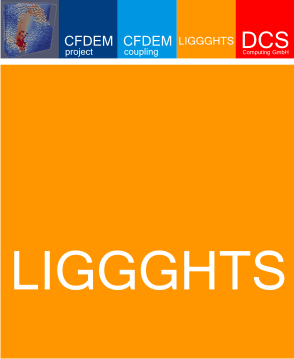

LIGGGHTS Documentation
######################

|ProjectVersion|

----------

----------

.. note::

   This is an academic adaptation of the LIGGGHTS software package, released by
   the Department of Particulate Flow Modelling (PFM) at `Johannes Kepler University
   Linz <http://www.jku.at>`_, Austria.
   This offering is not approved or endorsed by DCS Computing GmbH, the producer
   of the LIGGGHTS\ |reg| and CFDEM\ |reg|\ coupling software and owner of the
   LIGGGHTS and CFDEM\ |reg| trade marks.

.. |reg|    unicode:: U+000AE .. REGISTERED SIGN

The LIGGGHTS open-source simulation software
============================================

LIGGGHTS stands for LAMMPS Improved for General Granular and Granular
Heat Transfer Simulations. It is part of the `CFDEMproject <liws_>`_.

The original developers of LIGGGHTS are Christoph Kloss (DCS Computing GmbH, Linz and JKU Linz)
and Richard Berger (JKU Linz), with major contributions from Philippe Seil, Andreas Aigner
and Stefan Amberger (all JKU Linz) and Christoph Goniva (DCS Computing GmbH, Linz and JKU Linz)

`CFDEMproject <liws_>`_ has more information about the code and its uses.
For questions about the code, please use the forums at `CFDEMproject <liws_>`_.

LIGGGHTS is based on LAMMPS (see below), and so is its manual. So if the manual says
'LAMMPS', you could read 'LIGGGHTS' instead. However, we want to make clear which
parts of the code and framework stem from the LAMMPS base.

LIGGGHTS Version info:
----------------------

All LIGGGHTS versions are based on a specific version of LAMMPS, as printed in
the file src/version.h. LIGGGHTS versions are identified by a version number
(in src/version\_liggghts.txt, e.g. '18.03'),
a branch name (e.g. 'LIGGGHTS-PFM' for the PFM release of LIGGGHTS),
compilation info (date / time stamp and user name), and a LAMMPS version
number (which is the LAMMPS version that the LIGGGHTS release is based on).
For info on the LAMMPS version, see below.

LAMMPS Version info:
--------------------

The LAMMPS "version" is the date when it was released, such as 1 May
2010. LAMMPS is updated continuously.  Whenever we fix a bug or add a
feature, we release it immediately, and post a notice on `this page of the WWW site <bug_>`_.
Each dated copy of LAMMPS contains all the
features and bug-fixes up to and including that version date. The
version date is printed to the screen and logfile every time you run
LAMMPS. It is also in the file src/version.h and in the LAMMPS
directory name created when you unpack a tarball, and at the top of
the first page of the manual (this page).

* If you browse the HTML doc pages on the LAMMPS WWW site, they always
  describe the most current version of LAMMPS.
* If you browse the HTML doc pages included in your tarball, they
  describe the version you have.
* The `PDF file <Manual.pdf>`_ on the WWW site or in the tarball is updated
  about once per month.  This is because it is large, and we don't want
  it to be part of every patch.
* There is also a `Developer.pdf <Developer.pdf>`_ file in the doc
  directory, which describes the internal structure and algorithms of
  LAMMPS.

LAMMPS stands for Large-scale Atomic/Molecular Massively Parallel
Simulator.

LAMMPS is a classical molecular dynamics simulation code designed to
run efficiently on parallel computers.  It was developed at Sandia
National Laboratories, a US Department of Energy facility, with
funding from the DOE.  It is an open-source code, distributed freely
under the terms of the GNU Public License (GPL).

The original developers of LAMMPS are `Steve Plimpton <sjp_>`_, Aidan
Thompson, and Paul Crozier who can be contacted at
athomps at sandia.gov.  The `LAMMPS WWW Site <lws_>`_ at
https://www.lammps.org/ has more information about the code and its
uses.

.. _bug: https://www.lammps.org/bug.html

.. _sjp: http://www.sandia.gov/~sjplimp

----------

Structure of the LAMMPS documentation
=====================================

The LAMMPS documentation is organized into the following sections.  If
you find errors or omissions in this manual or have suggestions for
useful information to add, please send an email to the developers so
we can improve the LAMMPS documentation.

Once you are familiar with LAMMPS, you may want to bookmark :ref:`this page <comm>` at Section\_commands.html#comm since
it gives quick access to documentation for all LAMMPS commands.

`PDF file <Manual.pdf>`_ of the entire manual, generated by
`htmldoc <http://www.easysw.com/htmldoc>`_

.. toctree::
   :maxdepth: 2
   :numbered:
   :caption: User Documentation
   :name: userdoc
   :includehidden:

   Section_intro
   Section_start
   Section_commands
   Section_gran_models
   Section_packages
   Section_accelerate
   Section_howto
   superquadric_simulations
   Section_example
   Section_perf
   Section_tools
   Section_modify
   Section_python
   Section_errors
   Section_history

.. toctree::
   :caption: Index
   :name: index
   :hidden:

   tutorials
   commands
   computes
   fixes
   pairs
   granular
   bonds
   angles
   dihedrals
   impropers

.. only:: html

   Indices and tables
   ==================

   * :ref:`genindex`
   * :ref:`search`

.. _liws: http://www.cfdem.com

.. _lws: https://www.lammps.org/
