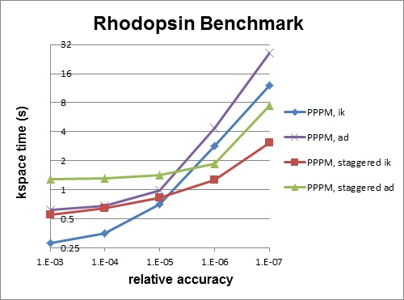

Accelerating LAMMPS performance
===============================

This section describes various methods for improving LAMMPS
performance for different classes of problems running on different
kinds of machines.

| 6.1 :ref:`Measuring performance <acc_1>`
| 6.2 :ref:`General strategies <acc_2>`
| 6.3 :ref:`Packages with optimized styles <acc_3>`
| 6.4 :ref:`OPT package <acc_4>`
| 6.5 :ref:`USER-OMP package <acc_5>`
| 6.6 :ref:`GPU package <acc_6>`
| 6.7 :ref:`USER-CUDA package <acc_7>`
| 6.8 :ref:`Comparison of GPU and USER-CUDA packages <acc_8>`
| 6.9 :ref:`MPI/OpenMP hybrid parallelization in LIGGGHTS <acc_9>` 
| 

.. _acc\_1:

Measuring performance
----------------------------------

Before trying to make your simulation run faster, you should
understand how it currently performs and where the bottlenecks are.

The best way to do this is run the your system (actual number of
atoms) for a modest number of timesteps (say 100, or a few 100 at
most) on several different processor counts, including a single
processor if possible.  Do this for an equilibrium version of your
system, so that the 100-step timings are representative of a much
longer run.  There is typically no need to run for 1000s or timesteps
to get accurate timings; you can simply extrapolate from short runs.

For the set of runs, look at the timing data printed to the screen and
log file at the end of each LAMMPS run.  :ref:`This section <start_8>` of the manual has an overview.

Running on one (or a few processors) should give a good estimate of
the serial performance and what portions of the timestep are taking
the most time.  Running the same problem on a few different processor
counts should give an estimate of parallel scalability.  I.e. if the
simulation runs 16x faster on 16 processors, its 100% parallel
efficient; if it runs 8x faster on 16 processors, it's 50% efficient.

The most important data to look at in the timing info is the timing
breakdown and relative percentages.  For example, trying different
options for speeding up the long-range solvers will have little impact
if they only consume 10% of the run time.  If the pairwise time is
dominating, you may want to look at GPU or OMP versions of the pair
style, as discussed below.  Comparing how the percentages change as
you increase the processor count gives you a sense of how different
operations within the timestep are scaling.  Note that if you are
running with a Kspace solver, there is additional output on the
breakdown of the Kspace time.  For PPPM, this includes the fraction
spent on FFTs, which can be communication intensive.

Another important detail in the timing info are the histograms of
atoms counts and neighbor counts.  If these vary widely across
processors, you have a load-imbalance issue.  This often results in
inaccurate relative timing data, because processors have to wait when
communication occurs for other processors to catch up.  Thus the
reported times for "Communication" or "Other" may be higher than they
really are, due to load-imbalance.  If this is an issue, you can
uncomment the MPI\_Barrier() lines in src/timer.cpp, and recompile
LAMMPS, to obtain synchronized timings.

----------

.. _acc\_2:

General strategies
-------------------------------

.. note::

   this sub-section is still a work in progress

Here is a list of general ideas for improving simulation performance.
Most of them are only applicable to certain models and certain
bottlenecks in the current performance, so let the timing data you
initially generate be your guide.  It is hard, if not impossible, to
predict how much difference these options will make, since it is a
function of your problem and your machine.  There is no substitute for
simply trying them out.

* rRESPA
* 2-FFT PPPM
* Staggered PPPM
* single vs double PPPM
* partial charge PPPM
* verlet/split
* processor mapping via processors numa command
* load-balancing: balance and fix balance
* processor command for layout
* OMP when lots of cores

2-FFT PPPM, also called *analytic differentiation* or *ad* PPPM, uses
2 FFTs instead of the 4 FFTs used by the default *ik differentiation*
PPPM. However, 2-FFT PPPM also requires a slightly larger mesh size to
achieve the same accuracy as 4-FFT PPPM. For problems where the FFT
cost is the performance bottleneck (typically large problems running
on many processors), 2-FFT PPPM may be faster than 4-FFT PPPM.

Staggered PPPM performs calculations using two different meshes, one
shifted slightly with respect to the other.  This can reduce force
aliasing errors and increase the accuracy of the method, but also
doubles the amount of work required. For high relative accuracy, using
staggered PPPM allows one to half the mesh size in each dimension as
compared to regular PPPM, which can give around a 4x speedup in the
kspace time. However, for low relative accuracy, using staggered PPPM
gives little benefit and can be up to 2x slower in the kspace
time. For example, the rhodopsin benchmark was run on a single
processor, and results for kspace time vs. relative accuracy for the
different methods are shown in the figure below.  For this system,
staggered PPPM (using ik differentiation) becomes useful when using a
relative accuracy of slightly greater than 1e-5 and above.

.. warning::

   Using staggered PPPM may not give the same increase in
   accuracy of energy and pressure as it does in forces, so some caution
   must be used if energy and/or pressure are quantities of interest,
   such as when using a barostat.

----------

.. _acc\_3:

Packages with optimized styles
-------------------------------------------

Accelerated versions of various :doc:`pair\_style <pair_style>`,
:doc:`fixes <fix>`, :doc:`computes <compute>`, and other commands have
been added to LAMMPS, which will typically run faster than the
standard non-accelerated versions, if you have the appropriate
hardware on your system.

The accelerated styles have the same name as the standard styles,
except that a suffix is appended.  Otherwise, the syntax for the
command is identical, their functionality is the same, and the
numerical results it produces should also be identical, except for
precision and round-off issues.

For example, all of these variants of the basic Lennard-Jones pair
style exist in LAMMPS:

* :doc:`pair\_style lj/cut <pair_lj>`
* :doc:`pair\_style lj/cut/opt <pair_lj>`
* :doc:`pair\_style lj/cut/omp <pair_lj>`
* :doc:`pair\_style lj/cut/gpu <pair_lj>`
* :doc:`pair\_style lj/cut/cuda <pair_lj>`

Assuming you have built LAMMPS with the appropriate package, these
styles can be invoked by specifying them explicitly in your input
script.  Or you can use the :ref:`-suffix command-line switch <start_7>` to invoke the accelerated versions
automatically, without changing your input script.  The
:doc:`suffix <suffix>` command allows you to set a suffix explicitly and
to turn off/on the command-line switch setting, both from within your
input script.

Styles with an "opt" suffix are part of the OPT package and typically
speed-up the pairwise calculations of your simulation by 5-25%.

Styles with an "omp" suffix are part of the USER-OMP package and allow
a pair-style to be run in multi-threaded mode using OpenMP.  This can
be useful on nodes with high-core counts when using less MPI processes
than cores is advantageous, e.g. when running with PPPM so that FFTs
are run on fewer MPI processors or when the many MPI tasks would
overload the available bandwidth for communication.

Styles with a "gpu" or "cuda" suffix are part of the GPU or USER-CUDA
packages, and can be run on NVIDIA GPUs associated with your CPUs.
The speed-up due to GPU usage depends on a variety of factors, as
discussed below.

To see what styles are currently available in each of the accelerated
packages, see :ref:`Section\_commands 5 <cmd_5>` of the
manual.  A list of accelerated styles is included in the pair, fix,
compute, and kspace sections.

The following sections explain:

* what hardware and software the accelerated styles require
* how to build LAMMPS with the accelerated packages in place
* what changes (if any) are needed in your input scripts
* guidelines for best performance
* speed-ups you can expect

The final section compares and contrasts the GPU and USER-CUDA
packages, since they are both designed to use NVIDIA GPU hardware.

----------

.. _acc\_4:

OPT package
------------------------

The OPT package was developed by James Fischer (High Performance
Technologies), David Richie, and Vincent Natoli (Stone Ridge
Technologies).  It contains a handful of pair styles whose compute()
methods were rewritten in C++ templated form to reduce the overhead
due to if tests and other conditional code.

The procedure for building LAMMPS with the OPT package is simple.  It
is the same as for any other package which has no additional library
dependencies:

.. parsed-literal::

   make yes-opt
   make machine

If your input script uses one of the OPT pair styles,
you can run it as follows:

.. parsed-literal::

   lmp_machine -sf opt < in.script
   mpirun -np 4 lmp_machine -sf opt < in.script

You should see a reduction in the "Pair time" printed out at the end
of the run.  On most machines and problems, this will typically be a 5
to 20% savings.

----------

.. _acc\_5:

USER-OMP package
-----------------------------

The USER-OMP package was developed by Axel Kohlmeyer at Temple University.
It provides multi-threaded versions of most pair styles, all dihedral
styles and a few fixes in LAMMPS. The package currently uses the OpenMP
interface which requires using a specific compiler flag in the makefile
to enable multiple threads; without this flag the corresponding pair
styles will still be compiled and work, but do not support multi-threading.

**Building LAMMPS with the USER-OMP package:**

The procedure for building LAMMPS with the USER-OMP package is simple.
You have to edit your machine specific makefile to add the flag to
enable OpenMP support to the CCFLAGS and LINKFLAGS variables. For the
GNU compilers for example this flag is called *-fopenmp*\ . Check your
compiler documentation to find out which flag you need to add.
The rest of the compilation is the same as for any other package which
has no additional library dependencies:

.. parsed-literal::

   make yes-user-omp
   make machine

Please note that this will only install accelerated versions
of styles that are already installed, so you want to install
this package as the last package, or else you may be missing
some accelerated styles. If you plan to uninstall some package,
you should first uninstall the USER-OMP package then the other
package and then re-install USER-OMP, to make sure that there
are no orphaned *omp* style files present, which would lead to
compilation errors.

If your input script uses one of regular styles that are also
exist as an OpenMP version in the USER-OMP package you can run
it as follows:

.. parsed-literal::

   env OMP_NUM_THREADS=4 lmp_serial -sf omp -in in.script
   env OMP_NUM_THREADS=2 mpirun -np 2 lmp_machine -sf omp -in in.script
   mpirun -x OMP_NUM_THREADS=2 -np 2 lmp_machine -sf omp -in in.script

The value of the environment variable OMP\_NUM\_THREADS determines how
many threads per MPI task are launched. All three examples above use
a total of 4 CPU cores.  For different MPI implementations the method
to pass the OMP\_NUM\_THREADS environment variable to all processes is
different.  Two different variants, one for MPICH and OpenMPI, respectively
are shown above.  Please check the documentation of your MPI installation
for additional details.  Alternatively, the value provided by OMP\_NUM\_THREADS
can be overridden with the :doc:`package omp <package>` command.
Depending on which styles are accelerated in your input, you should
see a reduction in the "Pair time" and/or "Bond time" and "Loop time"
printed out at the end of the run. The optimal ratio of MPI to OpenMP
can vary a lot and should always be confirmed through some benchmark
runs for the current system and on the current machine.

Restrictions
""""""""""""

None of the pair styles in the USER-OMP package support the "inner",
"middle", "outer" options for r-RESPA integration, only the "pair"
option is supported.

**Parallel efficiency and performance tips:**

In most simple cases the MPI parallelization in LAMMPS is more
efficient than multi-threading implemented in the USER-OMP package.
Also the parallel efficiency varies between individual styles.
On the other hand, in many cases you still want to use the *omp* version
- even when compiling or running without OpenMP support - since they
all contain optimizations similar to those in the OPT package, which
can result in serial speedup.

Using multi-threading is most effective under the following circumstances:

* Individual compute nodes have a significant number of CPU cores
  but the CPU itself has limited memory bandwidth, e.g. Intel Xeon 53xx
  (Clovertown) and 54xx (Harpertown) quad core processors. Running
  one MPI task per CPU core will result in significant performance
  degradation, so that running with 4 or even only 2 MPI tasks per
  nodes is faster. Running in hybrid MPI+OpenMP mode will reduce the
  inter-node communication bandwidth contention in the same way,
  but offers and additional speedup from utilizing the otherwise
  idle CPU cores.
* The interconnect used for MPI communication is not able to provide
  sufficient bandwidth for a large number of MPI tasks per node.
  This applies for example to running over gigabit ethernet or
  on Cray XT4 or XT5 series supercomputers. Same as in the aforementioned
  case this effect worsens with using an increasing number of nodes.
* The input is a system that has an inhomogeneous particle density
  which cannot be mapped well to the domain decomposition scheme
  that LAMMPS employs. While this can be to some degree alleviated
  through using the :doc:`processors <processors>` keyword, multi-threading
  provides a parallelism that parallelizes over the number of particles
  not their distribution in space.
* Finally, multi-threaded styles can improve performance when running
  LAMMPS in "capability mode", i.e. near the point where the MPI
  parallelism scales out. This can happen in particular when using
  as kspace style for long-range electrostatics. Here the scaling
  of the kspace style is the performance limiting factor and using
  multi-threaded styles allows to operate the kspace style at the
  limit of scaling and then increase performance parallelizing
  the real space calculations with hybrid MPI+OpenMP. Sometimes
  additional speedup can be achived by increasing the real-space
  coulomb cutoff and thus reducing the work in the kspace part.

The best parallel efficiency from *omp* styles is typically 
achieved when there is at least one MPI task per physical 
processor, i.e. socket or die.

Using threads on hyper-threading enabled cores is usually
counterproductive, as the cost in additional memory bandwidth
requirements is not offset by the gain in CPU utilization
through hyper-threading.

A description of the multi-threading strategy and some performance
examples are `presented here <http://sites.google.com/site/akohlmey/software/lammps-icms/lammps-icms-tms2011-talk.pdf?attredirects=0&d=1>`_

----------

.. _acc\_6:

GPU package
------------------------

The GPU package was developed by Mike Brown at ORNL.  It provides GPU
versions of several pair styles and for long-range Coulombics via the
PPPM command.  It has the following features:

* The package is designed to exploit common GPU hardware configurations
  where one or more GPUs are coupled with many cores of a multi-core
  CPUs, e.g. within a node of a parallel machine.
* Atom-based data (e.g. coordinates, forces) moves back-and-forth
  between the CPU(s) and GPU every timestep.
* Neighbor lists can be constructed on the CPU or on the GPU
* The charge assignment and force interpolation portions of PPPM can be
  run on the GPU.  The FFT portion, which requires MPI communication
  between processors, runs on the CPU.
* Asynchronous force computations can be performed simultaneously on the
  CPU(s) and GPU.
* LAMMPS-specific code is in the GPU package.  It makes calls to a
  generic GPU library in the lib/gpu directory.  This library provides
  NVIDIA support as well as more general OpenCL support, so that the
  same functionality can eventually be supported on a variety of GPU
  hardware.

.. note::

   discuss 3 precisions
       if change, also have to re-link with LAMMPS;
       always use newton off;
       expt with differing numbers of CPUs vs GPU - can't tell what is fastest;
       give command line switches in examples;

"Max Mem / Proc" in the "GPU Time Info (average)" means the maximum memory used
at one time on the GPU for data storage by a single MPI process.

**Hardware and software requirements:**

To use this package, you currently need to have specific NVIDIA
hardware and install specific NVIDIA CUDA software on your system:

* Check if you have an NVIDIA card: cat /proc/driver/nvidia/cards/0
* Go to http://www.nvidia.com/object/cuda\_get.html
* Install a driver and toolkit appropriate for your system (SDK is not necessary)
* Follow the instructions in lammps/lib/gpu/README to build the library (see below)
* Run lammps/lib/gpu/nvc\_get\_devices to list supported devices and properties

**Building LAMMPS with the GPU package:**

As with other packages that include a separately compiled library, you
need to first build the GPU library, before building LAMMPS itself.
General instructions for doing this are in :ref:`this section <start_3>` of the manual.  For this package,
do the following, using a Makefile in lib/gpu appropriate for your
system:

.. parsed-literal::

   cd lammps/lib/gpu
   make -f Makefile.linux
   (see further instructions in lammps/lib/gpu/README)

If you are successful, you will produce the file lib/libgpu.a.

Now you are ready to build LAMMPS with the GPU package installed:

.. parsed-literal::

   cd lammps/src
   make yes-gpu
   make machine

Note that the lo-level Makefile (e.g. src/MAKE/Makefile.linux) has
these settings: gpu\_SYSINC, gpu\_SYSLIB, gpu\_SYSPATH.  These need to be
set appropriately to include the paths and settings for the CUDA
system software on your machine.  See src/MAKE/Makefile.g++ for an
example.

**GPU configuration**

When using GPUs, you are restricted to one physical GPU per LAMMPS
process, which is an MPI process running on a single core or
processor.  Multiple MPI processes (CPU cores) can share a single GPU,
and in many cases it will be more efficient to run this way.

**Input script requirements:**

Additional input script requirements to run pair or PPPM styles with a
*gpu* suffix are as follows:

* To invoke specific styles from the GPU package, you can either append
  "gpu" to the style name (e.g. pair\_style lj/cut/gpu), or use the
  :ref:`-suffix command-line switch <start_7>`, or use the
  :doc:`suffix <suffix>` command.
* The :doc:`newton pair <newton>` setting must be *off*\ .
* The :doc:`package gpu <package>` command must be used near the beginning
  of your script to control the GPU selection and initialization
  settings.  It also has an option to enable asynchronous splitting of
  force computations between the CPUs and GPUs.

As an example, if you have two GPUs per node and 8 CPU cores per node,
and would like to run on 4 nodes (32 cores) with dynamic balancing of
force calculation across CPU and GPU cores, you could specify

.. parsed-literal::

   package gpu force/neigh 0 1 -1

In this case, all CPU cores and GPU devices on the nodes would be
utilized.  Each GPU device would be shared by 4 CPU cores. The CPU
cores would perform force calculations for some fraction of the
particles at the same time the GPUs performed force calculation for
the other particles.

**Timing output:**

As described by the :doc:`package gpu <package>` command, GPU
accelerated pair styles can perform computations asynchronously with
CPU computations. The "Pair" time reported by LAMMPS will be the
maximum of the time required to complete the CPU pair style
computations and the time required to complete the GPU pair style
computations. Any time spent for GPU-enabled pair styles for
computations that run simultaneously with :doc:`bond <bond_style>`,
:doc:`angle <angle_style>`, :doc:`dihedral <dihedral_style>`,
:doc:`improper <improper_style>`, and :doc:`long-range <kspace_style>`
calculations will not be included in the "Pair" time.

When the *mode* setting for the package gpu command is force/neigh,
the time for neighbor list calculations on the GPU will be added into
the "Pair" time, not the "Neigh" time.  An additional breakdown of the
times required for various tasks on the GPU (data copy, neighbor
calculations, force computations, etc) are output only with the LAMMPS
screen output (not in the log file) at the end of each run.  These
timings represent total time spent on the GPU for each routine,
regardless of asynchronous CPU calculations.

**Performance tips:**

Generally speaking, for best performance, you should use multiple CPUs
per GPU, as provided my most multi-core CPU/GPU configurations.

Because of the large number of cores within each GPU device, it may be
more efficient to run on fewer processes per GPU when the number of
particles per MPI process is small (100's of particles); this can be
necessary to keep the GPU cores busy.

See the lammps/lib/gpu/README file for instructions on how to build
the GPU library for single, mixed, or double precision.  The latter
requires that your GPU card support double precision.

----------

.. _acc\_7:

USER-CUDA package
------------------------------

The USER-CUDA package was developed by Christian Trott at U Technology
Ilmenau in Germany.  It provides NVIDIA GPU versions of many pair
styles, many fixes, a few computes, and for long-range Coulombics via
the PPPM command.  It has the following features:

* The package is designed to allow an entire LAMMPS calculation, for
  many timesteps, to run entirely on the GPU (except for inter-processor
  MPI communication), so that atom-based data (e.g. coordinates, forces)
  do not have to move back-and-forth between the CPU and GPU.
* The speed-up advantage of this approach is typically better when the
  number of atoms per GPU is large
* Data will stay on the GPU until a timestep where a non-GPU-ized fix or
  compute is invoked.  Whenever a non-GPU operation occurs (fix,
  compute, output), data automatically moves back to the CPU as needed.
  This may incur a performance penalty, but should otherwise work
  transparently.
* Neighbor lists for GPU-ized pair styles are constructed on the
  GPU.
* The package only supports use of a single CPU (core) with each
  GPU.

**Hardware and software requirements:**

To use this package, you need to have specific NVIDIA hardware and
install specific NVIDIA CUDA software on your system.

Your NVIDIA GPU needs to support Compute Capability 1.3. This list may
help you to find out the Compute Capability of your card:

http://en.wikipedia.org/wiki/Comparison\_of\_Nvidia\_graphics\_processing\_units

Install the Nvidia Cuda Toolkit in version 3.2 or higher and the
corresponding GPU drivers. The Nvidia Cuda SDK is not required for
LAMMPSCUDA but we recommend it be installed.  You can then make sure
that its sample projects can be compiled without problems.

**Building LAMMPS with the USER-CUDA package:**

As with other packages that include a separately compiled library, you
need to first build the USER-CUDA library, before building LAMMPS
itself.  General instructions for doing this are in :ref:`this section <start_3>` of the manual.  For this package,
do the following, using settings in the lib/cuda Makefiles appropriate
for your system:

* Go to the lammps/lib/cuda directory
* If your *CUDA* toolkit is not installed in the default system directory
  */usr/local/cuda* edit the file *lib/cuda/Makefile.common*
  accordingly.
* Type "make OPTIONS", where *OPTIONS* are one or more of the following
  options. The settings will be written to the
  *lib/cuda/Makefile.defaults* and used in the next step.
  
  .. parsed-literal::
  
     *precision=N* to set the precision level
       N = 1 for single precision (default)
       N = 2 for double precision
       N = 3 for positions in double precision
       N = 4 for positions and velocities in double precision
     *arch=M* to set GPU compute capability
       M = 20 for CC2.0 (GF100/110, e.g. C2050,GTX580,GTX470) (default)
       M = 21 for CC2.1 (GF104/114,  e.g. GTX560, GTX460, GTX450)
       M = 13 for CC1.3 (GF200, e.g. C1060, GTX285)
     *prec_timer=0/1* to use hi-precision timers
       0 = do not use them (default)
       1 = use these timers
       this is usually only useful for Mac machines 
     *dbg=0/1* to activate debug mode
       0 = no debug mode (default)
       1 = yes debug mode
       this is only useful for developers
     *cufft=1* to determine usage of CUDA FFT library
       0 = no CUFFT support (default)
       in the future other CUDA-enabled FFT libraries might be supported

* Type "make" to build the library.  If you are successful, you will
  produce the file lib/libcuda.a.

Now you are ready to build LAMMPS with the USER-CUDA package installed:

.. parsed-literal::

   cd lammps/src
   make yes-user-cuda
   make machine

Note that the LAMMPS build references the lib/cuda/Makefile.common
file to extract setting specific CUDA settings.  So it is important
that you have first built the cuda library (in lib/cuda) using
settings appropriate to your system.

**Input script requirements:**

Additional input script requirements to run styles with a *cuda*
suffix are as follows:

* To invoke specific styles from the USER-CUDA package, you can either
  append "cuda" to the style name (e.g. pair\_style lj/cut/cuda), or use
  the :ref:`-suffix command-line switch <start_7>`, or use
  the :doc:`suffix <suffix>` command.  One exception is that the
  :doc:`kspace\_style pppm/cuda <kspace_style>` command has to be requested
  explicitly.
* To use the USER-CUDA package with its default settings, no additional
  command is needed in your input script.  This is because when LAMMPS
  starts up, it detects if it has been built with the USER-CUDA package.
  See the :ref:`-cuda command-line switch <start_7>` for
  more details.
* To change settings for the USER-CUDA package at run-time, the :doc:`package cuda <package>` command can be used near the beginning of your
  input script.  See the :doc:`package <package>` command doc page for
  details.

**Performance tips:**

The USER-CUDA package offers more speed-up relative to CPU performance
when the number of atoms per GPU is large, e.g. on the order of tens
or hundreds of 1000s.

As noted above, this package will continue to run a simulation
entirely on the GPU(s) (except for inter-processor MPI communication),
for multiple timesteps, until a CPU calculation is required, either by
a fix or compute that is non-GPU-ized, or until output is performed
(thermo or dump snapshot or restart file).  The less often this
occurs, the faster your simulation will run.

.. _acc\_8:

Comparison of GPU and USER-CUDA packages
-----------------------------------------------------

Both the GPU and USER-CUDA packages accelerate a LAMMPS calculation
using NVIDIA hardware, but they do it in different ways.

As a consequence, for a particular simulation on specific hardware,
one package may be faster than the other.  We give guidelines below,
but the best way to determine which package is faster for your input
script is to try both of them on your machine.  See the benchmarking
section below for examples where this has been done.

**Guidelines for using each package optimally:**

* The GPU package allows you to assign multiple CPUs (cores) to a single
  GPU (a common configuration for "hybrid" nodes that contain multicore
  CPU(s) and GPU(s)) and works effectively in this mode.  The USER-CUDA
  package does not allow this; you can only use one CPU per GPU.
* The GPU package moves per-atom data (coordinates, forces)
  back-and-forth between the CPU and GPU every timestep.  The USER-CUDA
  package only does this on timesteps when a CPU calculation is required
  (e.g. to invoke a fix or compute that is non-GPU-ized).  Hence, if you
  can formulate your input script to only use GPU-ized fixes and
  computes, and avoid doing I/O too often (thermo output, dump file
  snapshots, restart files), then the data transfer cost of the
  USER-CUDA package can be very low, causing it to run faster than the
  GPU package.
* The GPU package is often faster than the USER-CUDA package, if the
  number of atoms per GPU is "small".  The crossover point, in terms of
  atoms/GPU at which the USER-CUDA package becomes faster depends
  strongly on the pair style.  For example, for a simple Lennard Jones
  system the crossover (in single precision) is often about 50K-100K
  atoms per GPU.  When performing double precision calculations the
  crossover point can be significantly smaller.
* Both packages compute bonded interactions (bonds, angles, etc) on the
  CPU.  This means a model with bonds will force the USER-CUDA package
  to transfer per-atom data back-and-forth between the CPU and GPU every
  timestep.  If the GPU package is running with several MPI processes
  assigned to one GPU, the cost of computing the bonded interactions is
  spread across more CPUs and hence the GPU package can run faster.
* When using the GPU package with multiple CPUs assigned to one GPU, its
  performance depends to some extent on high bandwidth between the CPUs
  and the GPU.  Hence its performance is affected if full 16 PCIe lanes
  are not available for each GPU.  In HPC environments this can be the
  case if S2050/70 servers are used, where two devices generally share
  one PCIe 2.0 16x slot.  Also many multi-GPU mainboards do not provide
  full 16 lanes to each of the PCIe 2.0 16x slots.

**Differences between the two packages:**

* The GPU package accelerates only pair force, neighbor list, and PPPM
  calculations.  The USER-CUDA package currently supports a wider range
  of pair styles and can also accelerate many fix styles and some
  compute styles, as well as neighbor list and PPPM calculations.
* The USER-CUDA package does not support acceleration for minimization.
* The USER-CUDA package does not support hybrid pair styles.
* The USER-CUDA package can order atoms in the neighbor list differently
  from run to run resulting in a different order for force accumulation.
* The USER-CUDA package has a limit on the number of atom types that can be
  used in a simulation.
* The GPU package requires neighbor lists to be built on the CPU when using
  exclusion lists or a triclinic simulation box.
* The GPU package uses more GPU memory than the USER-CUDA package.  This
  is generally not a problem since typical runs are computation-limited
  rather than memory-limited.

Examples
""""""""

The LAMMPS distribution has two directories with sample input scripts
for the GPU and USER-CUDA packages.

* lammps/examples/gpu = GPU package files
* lammps/examples/USER/cuda = USER-CUDA package files

These contain input scripts for identical systems, so they can be used
to benchmark the performance of both packages on your system.

.. _acc\_9:

MPI/OpenMP hybrid parallelization in LIGGGHTS
----------------------------------------------------------

Please see :doc:`hybrid parallelization <hybrid_parallelization>` for more details.

