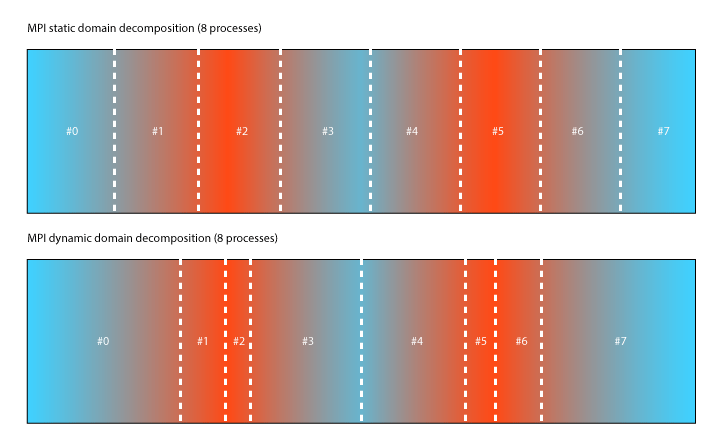
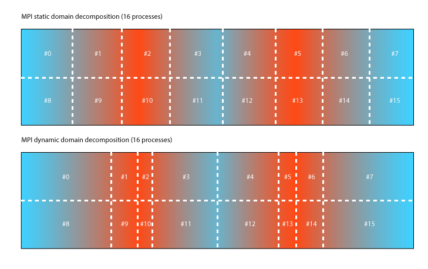
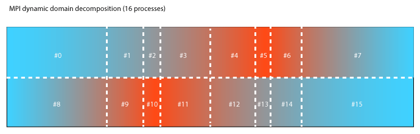
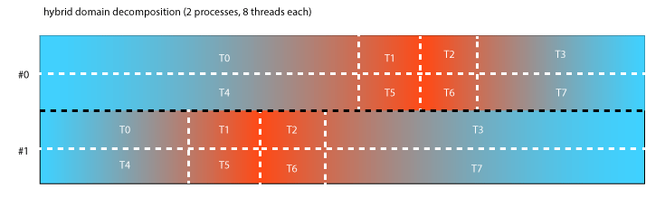
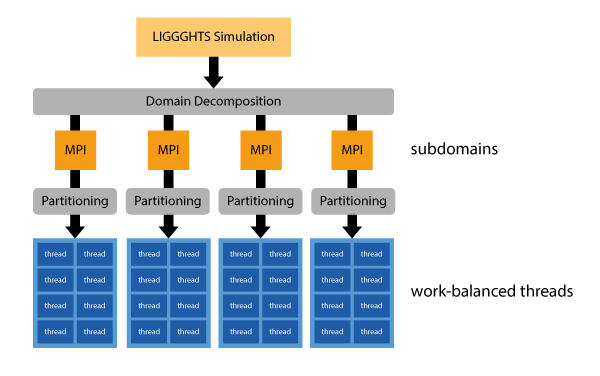

MPI/OpenMP hybrid parallelization in LIGGGHTS
=============================================

Motivation
----------

The MPI/OpenMP hybrid parallelization in LIGGGHTS is a new way to achieve better load-balancing within simulations. Traditional MPI simulations can only be load-balanced using :doc:`fix/balance <fix_balance>`. The following figure illustrates how static 8x1 decomposition might look like. In this example colors are used to show areas which require high amount of computational work (red) in contract to other areas which leave processors idle (blue). Using a static decomposition processes the boundaries of the domain can become idle quickly. To avoid this, MPI dynamic load balancing was introduced with :doc:`fix/balance <fix_balance>`. It adjusts the boundaries making sure each subdomain has an equal amount of particles in them.

MPI load-balancing works very well with simple decompositions. However load-imbalance remains a dominant issue if higher number of cores used. At some point decomposing along one dimension alone will no longer add any benefit. Adding a cut to additional dimensions will only work well if the load is symmetric. The following figure shows how the symmetric testcase can easily be computed using 16 processes in stead of 8 by adding another decomposition along the y-Axis.

Unsymmetrical loads are very difficult to decompose. The margin of error is significant. Simulations can take 2x-4x more time if decompositions are chosen poorly and MPI load-balancing used improperly. The following illustrates a simulation which is harder to decompose because the cuts in space span the entire domain.

A hybrid parallelization which uses MPI and OpenMP allows us to reduce the amount of MPI processes and let automatic partitioning figure out a good decomposition inside our subdomains. In our next Figure we show how the hybrid can use only two MPI processes to cut the domain in half along the y-Axis and then partitions the subdomains among 8 threads. In other words, our hybrid parallelization adds a second layer of parallelization to LIGGGHTS which is more flexible and does automatic load-balancing.

The main idea behind using a hybrid parallelization therefore is to first split the domain into large, potentially MPI-load-balanced portions. Each MPI subdomain is then further partitioned for a given number of threads.

Installation
------------

The hybrid parallelization is implemented using the OpenMP standard. This standard for threading is supported by most compiler vendors by now. Some still compilers only support it in their development versions right now. To compile LIGGGHTS with hybrid parallelization we need additional compiler flags and additional implementation files which replace some core components of the usual LIGGGHTS integration loop with threaded versions.

Prerequisites
^^^^^^^^^^^^^

* GCC >= 4.7
* Zoltan Library 3.6

Compiling Zoltan & Installing Zoltan
^^^^^^^^^^^^^^^^^^^^^^^^^^^^^^^^^^^^

Zoltan is a library containing many useful partitioning and load-balancing algorithms. We utilize this library in our implementation. Before compiling LIGGGHTS with hybrid parallelization, we need to compile and install this library as follows:

.. parsed-literal::

   cd LIGGGHTS-PFM/
   git submodule init
   git submodule update
   cd lib/zoltan/
   mkdir BUILD
   cd BUILD
   ../configure
   make everything
   make install

Compiling LIGGGHTS with hybrid parallelization
^^^^^^^^^^^^^^^^^^^^^^^^^^^^^^^^^^^^^^^^^^^^^^

Once all the prerequisites are met, we can compile a hybrid version of LIGGGHTS using the *hybrid* makefile.

.. parsed-literal::

   cd LIGGGHTS-PFM/src/
   make -j 4 hybrid

Basic Usage
-----------

Using this new parallelization of LIGGGHTS requires the compilation of a LIGGGHTS binary as mentioned in the previous section. This version of LIGGGHTS supports additional styles and fixes which all end with an additional /omp suffix.

Package OMP
^^^^^^^^^^^

Prior to using any OpenMP styles or fixes, one must enable OpenMP by using the :doc:`package <package>` command.

.. parsed-literal::

   package omp 8 force/neigh thread-binding verbose

The thread-binding option will force each thread to be bound to a CPU core using SMP-style numbering. This means that it assumes that cores which are next to each other are numbered with consecutive numbers.

Partitioning of Data
^^^^^^^^^^^^^^^^^^^^

Pair styles and wall fixes require particle data to be partitioned. Each thread will then operate on one of the partitions. Currently there is only a single partitioner implemented using the Zoltan library. Key-Value pairs passed as arguments to the *partitioner\_style* are passed 1:1 to the Zoltan library.

.. parsed-literal::

   partitioner_style zoltan RCB_REUSE 1

By default, the partitioner uses the following options:

+--------------------------+----------------+--------------------------------------------------------------------------------------------------------------------------------------------+
| DEBUG\_LEVEL             | 0              | Controls Debug output                                                                                                                      |
+--------------------------+----------------+--------------------------------------------------------------------------------------------------------------------------------------------+
| LB\_METHOD               | RCB            | Selection of RCB as partitioning algorithm                                                                                                 |
+--------------------------+----------------+--------------------------------------------------------------------------------------------------------------------------------------------+
| NUM\_GID\_ENTRIES        | 1              | number of global ids per element **DO NOT CHANGE**                                                                                         |
+--------------------------+----------------+--------------------------------------------------------------------------------------------------------------------------------------------+
| NUM\_LID\_ENTRIES        | 1              | number of local ids per element **DO NOT CHANGE**                                                                                          |
+--------------------------+----------------+--------------------------------------------------------------------------------------------------------------------------------------------+
| NUM\_LOCAL\_PARTS        | *NUM\_THREADS* | number of partitions generated. this should always be equal to the number of threads. This is done by default, therefore **DO NOT CHANGE** |
+--------------------------+----------------+--------------------------------------------------------------------------------------------------------------------------------------------+
| RETURN\_LISTS            | PARTS          | tells Zoltan to return a list containing the mapping of particles to parts **DO NOT CHANGE**                                               |
+--------------------------+----------------+--------------------------------------------------------------------------------------------------------------------------------------------+
| KEEP\_CUTS               | 1              | Zoltan should keep information of past partitionings **DO NOT CHANGE**                                                                     |
+--------------------------+----------------+--------------------------------------------------------------------------------------------------------------------------------------------+
| RCB\_REUSE               | 0              | Zoltan should use past partitioning information for repartitioning **Recommended to set to 1**                                             |
+--------------------------+----------------+--------------------------------------------------------------------------------------------------------------------------------------------+
| RCB\_OUTPUT\_LEVEL       | 0              | RCB specific debug output                                                                                                                  |
+--------------------------+----------------+--------------------------------------------------------------------------------------------------------------------------------------------+
| RCB\_RECTILINEAR\_BLOCKS | 0              | RCB specific option                                                                                                                        |
+--------------------------+----------------+--------------------------------------------------------------------------------------------------------------------------------------------+

Additional information can be found `here <http://www.cs.sandia.gov/zoltan/ug_html/ug_alg_rcb.html>`_.

Pair Styles
^^^^^^^^^^^

All granular pair styles have a OpenMP implementation. To select them simply use *gran/omp* instead of *gran* as :doc:`pair\_style <pair_style>`.

.. parsed-literal::

   pair_style gran/omp model hertz tangential history

Meshes
^^^^^^

Meshes of type :doc:`mesh/surface <fix_mesh_surface>` which are used by a wall fix are required to be replaced by their OpenMP version of :doc:`mesh/surface/omp <fix_mesh_surface>`.

.. parsed-literal::

   fix cadMix1 all mesh/surface/omp file meshes/Mixer.stl type 1

Walls
^^^^^

Walls of type :doc:`wall/gran <fix_wall_gran>` should be replaced by their OpenMP version of :doc:`wall/gran/omp <fix_wall_gran>`.

.. parsed-literal::

   fix meshes all wall/gran/omp model hertz tangential history mesh n_meshes 12 meshes cadShaft cadBlade1 cadBlade2 cadBlade3 cadBlade4 cadMix1 cadMix2 cadMix3 cadMix4 cadMix5 cadMix6 cadDrum

Other Fixes
^^^^^^^^^^^

The implementation of the hybrid parallelization is not feature complete. Some fixes might not even need an OpenMP version at all. Here is a list of other fixes which have been optimized so far.

Gravity
"""""""

The :doc:`gravity <fix_gravity>` fix should be replaced by :doc:`gravity/omp <fix_gravity>`.

.. parsed-literal::

   fix gravi all gravity/omp 9.81 vector 0.0 0.0 -1.0

Integration
"""""""""""

The :doc:`nve/sphere <fix_nve_sphere>` integration fix should be replaced by :doc:`nve/sphere/omp <fix_nve_sphere>`.

.. parsed-literal::

   fix integr nve_group nve/sphere/omp

Restrictions
""""""""""""

The MPI/OpenMP hybrid implementation can only be used if LIGGGHTS
was built with the USER-OMP and USER-ZOLTAN package. See the
:ref:`Making LAMMPS <start_3>` section for more info.

Insertion of particles is currently not optimized with OpenMP.

Related commands
""""""""""""""""

:doc:`package <package>`
:doc:`pair\_style <pair_style>`
:doc:`fix/wall/gran/omp <fix_wall_gran>`
:doc:`fix/mesh/surface/omp <fix_mesh_surface>`
:doc:`fix/nve/sphere/omp <fix_nve_sphere>`
:doc:`fix/gravity/omp <fix_gravity>`
:doc:`suffix <suffix>`

